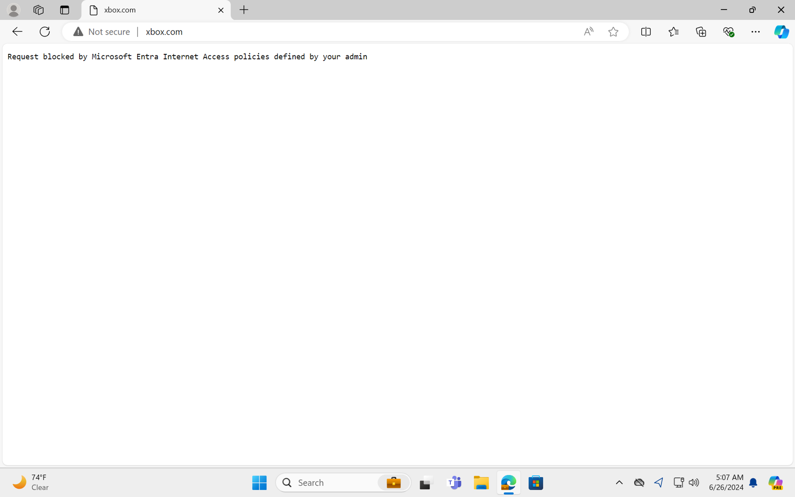
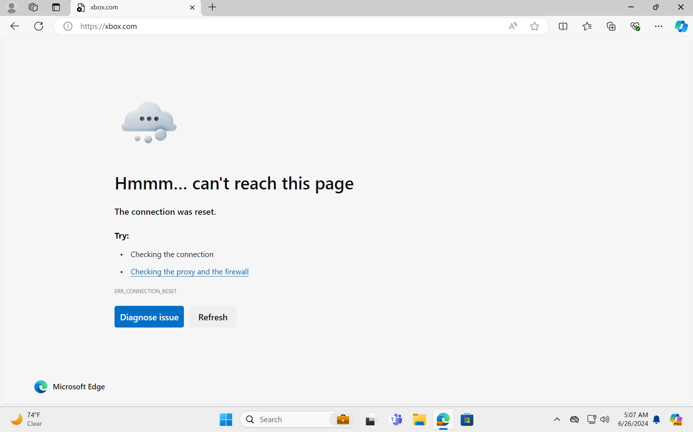

## Web content filtering

The key introductory feature for Microsoft Entra Internet Access for all apps is **Web content filtering**. This feature provides granular access control for web categories and Fully Qualified Domain Names (FQDNs). By explicitly blocking known inappropriate, malicious, or unsafe sites, you protect your users and their devices from any Internet connection whether they're remote or within the corporate network.

Web content filtering is implemented using filtering policies, which are grouped into security profiles, which can be linked to Conditional Access policies. To learn more about Conditional Access, see [Microsoft Entra Conditional Access](https://learn.microsoft.com/en-us/entra/identity/conditional-access//).

The web filtering feature is currently limited to user- and context-aware Fully Qualified Domain Name (FQDN)-based web category filtering and FQDN filtering.

## Prerequisites

- Administrators who interact with **Global Secure Access** features must have one or more of the following role assignments depending on the tasks they're performing.
   - The [Global Secure Access Administrator role](https://learn.microsoft.com/en-us/entra/identity/role-based-access-control/permissions-reference#global-secure-access-administrator) role to manage the Global Secure Access features.
   - The [Conditional Access Administrator](https://learn.microsoft.com/en-us/entra/identity/role-based-access-control/permissions-reference#conditional-access-administrator) to create and interact with Conditional Access policies.
- Complete the [Get started with Global Secure Access](https://learn.microsoft.com/en-us/entra/global-secure-access/quickstart-access-admin-center) guide. 
- [Install the Global Secure Access client](https://microsoft.github.io/GlobalSecureAccess/Pre-requisites/Install%20client#install-global-secure-access-client-on-your-windows-1011-client-device) on end user devices.
- You must disable Domain Name System (DNS) over HTTPS (Secure DNS) to tunnel network traffic. Use the rules of the fully qualified domain names (FQDNs) in the traffic forwarding profile. For more information, see [Configure the DNS client to support DoH](https://learn.microsoft.com/en-us/windows-server/networking/dns/doh-client-support#configure-the-dns-client-to-support-doh).
- Disable built-in DNS client on Chrome and Microsoft Edge.
- User Datagram Protocol (UDP) traffic (that is, QUIC) isn't supported in the current preview of Internet Access. Most websites support fallback to TCP when QUIC cannot be established. For improved user experience, you can deploy a Windows Firewall rule that blocks outbound UDP 443: `@New-NetFirewallRule -DisplayName "Block QUIC" -Direction Outbound -Action Block -Protocol UDP  -RemotePort 443`. 
 

- Review web content filtering concepts. For more information, see [web content filtering](https://learn.microsoft.com/en-us/entra/global-secure-access/concept-internet-access).

## High level steps

There are several steps to configuring web content filtering. Take note of where you need to configure a Conditional Access policy.

1. Enable internet traffic forwarding
1. Create a web content filtering policy
1. Create a security profile
1. Link the security profile to a Conditional Access policy
1. Assign users or groups to the traffic forwarding profile

## Enable internet traffic forwarding
The first step is to enable the Internet Access traffic forwarding profile. To learn more about the profile and how to enable it, see [How to manage the Internet Access traffic forwarding profile](https://learn.microsoft.com/en-us/entra/global-secure-access/how-to-manage-internet-access-profile).

## Create a web content filtering policy

1. Browse to **Global Secure Access** > **Secure** > **web content filtering policy**.
1. Select **Create policy**.
1. Enter a name and description for the policy and select **Next**.
1. Select **Add rule**.
1. Enter a name, select a [web category](https://learn.microsoft.com/en-us/entra/global-secure-access/reference-web-content-filtering-categories) or a valid FQDN, and then select **Add**.
     - Valid FQDNs in this feature can also include wildcards using the asterisk symbol, *.
1. Select **Next** to review the policy and then select **Create policy**.

## Create a security profile

Security profiles are a grouping of filtering policies. You can assign, or link, security profiles with Microsoft Entra Conditional Access policies. One security profile can contain multiple filtering policies. And one security profile can be associated with multiple Conditional Access policies.

In this step, you create a security profile to group filtering policies. Then you assign, or link, the security profiles with a Conditional Access policy to make them user or context aware.

> [!NOTE]
> To learn more about Microsoft Entra Conditional Access policies, see [Building a Conditional Access policy](https://learn.microsoft.com/en-us/entra/identity/conditional-access/concept-conditional-access-policies).

1. Browse to **Global Secure Access** > **Secure** > **Security profiles**.
1. Select **Create profile**.
1. Enter a name and description for the policy and select **Next**.
1. Select **Link a policy** and then select **Existing policy**.
1. Select the web content filtering policy you already created and select **Add**.
1. Select **Next** to review the security profile and associated policy.
1. Select **Create a profile**.
1. Select **Refresh** to refresh the profiles page and view the new profile.

## Create and link Conditional Access policy

Create a Conditional Access policy for end users or groups and deliver your security profile through Conditional Access Session controls. Conditional Access is the delivery mechanism for user and context awareness for Internet Access policies. To learn more about session controls, see [Conditional Access: Session](https://learn.microsoft.com/en-us/entra/identity/conditional-access/concept-conditional-access-session).

1. Browse to **Identity** > **Protection** > **Conditional Access**.
1. Select **Create new policy**.
1. Enter a name and assign a user or group.
1. Select **Target resources** and **Global Secure Access** from the drop-down menu to set what the policy applies to.
1. Select **Internet traffic** from the drop-down menu to set the traffic profile this policy applies to.
1. Select **Session** > **Use Global Secure Access security profile** and choose a security profile.
1. Select **Select**.
1. In the **Enable policy** section, ensure **On** is selected.
1. Select **Create**.

## User and group assignments
You can scope the Internet Access profile to specific users and groups. To learn more about user and group assignment, see [How to assign and manage users and groups with traffic forwarding profiles](https://learn.microsoft.com/en-us/entra/global-secure-access/how-to-manage-users-groups-assignment).

## Verify end user policy enforcement

Use a Windows device with the Global Secure Access client installed. Sign in as a user that is assigned the Internet traffic acquisition profile. Test that navigating to websites is allowed or restricted as expected.

1. Right-click on the Global Secure Access client icon in the task manager tray and open **Advanced Diagnostics** > **Forwarding profile**. Ensure that the Internet access acquisition rules are present. Also, check if the hostname acquisition and flows for the users Internet traffic are being acquired while browsing.

1. Navigate to allowed and blocked sites and check if they behave properly. Browse to **Global Secure Access** > **Monitor** > **Traffic logs** to confirm traffic is blocked or allowed appropriately.

The current blocking experience for all browsers includes a plaintext browser error for HTTP traffic and a "Connection Reset" browser error for HTTPS traffic.

> [!NOTE]
> Configuration changes in the Global Secure Access experience related to web content filtering typically take effect in less than 5 minutes. Configuration changes in Conditional Access related to web content filtering take effect in approximately one hour.

