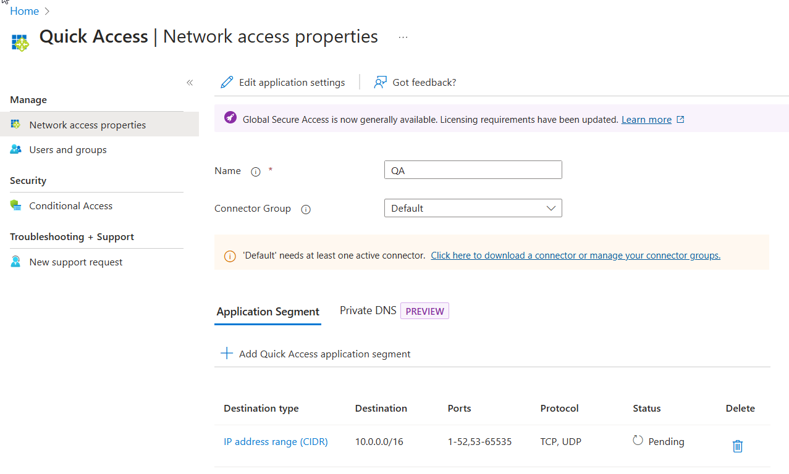
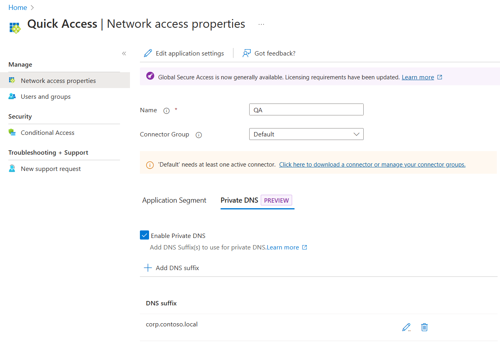

This guide covers how to configure Private Access to provide equivalent access to what is normally provided by users' VPN.
If you are planning to test Private Access with work devices (as opposed to test devices) and need to continue accessing a broad set of private (on-premises) resources, VPN Replacement scenario is a great place to start.

## Pre-requisites
You will need the network subnets where on-premises resources resources are located and that should be accessed through Private Access.
For example: 10.0.0.0/16 or 10.1.2.0/24,10.1.3.0/24.

The Private Network Connector will need access to these IP.

## Configure Quick Access

1. Sign in to the [Microsoft Entra admin center](https://entra.microsoft.com) with the appropriate roles.
2. Browse to **Global Secure Access** > **Applications** > **Quick access**.
3. Enter a name.
4. Select a Connector group from the dropdown menu.
5. Select **Save** to create your "Quick Access" app without FQDNs, IP addresses, and private DNS suffixes.
6. In the **Create application segment** panel that opens, select a **Destination type**.
7. Add IPs or subnets required
8. Specify ports 1-52,54-65535 and protocols TCP and UDP for each application segment you create
9. Add additional Application Segments, if required.
10. Select **Save** when you're finished.

Example:

### Add private DNS suffixes
Add a DNS suffix to use for private DNS. These should include all DNS suffixes required for on-premises access. Most notably, the Active Directory forest name.

1. Select **Private DNS** tab.
2. Select the checkbox to **enable private DNS**.
3. Select **Add DNS suffix**.
4. Enter the DNS suffix and then select **Add**.

Example:

## Assign users and groups

When you configure Quick Access, a new enterprise app is created on your behalf. You need to grant access to the Quick Access app you created by assigning users and/or groups to the app. 

You can view the properties from **Quick Access** or navigate to **Enterprise applications** and search for your Quick Access app.

1. Select **Users and groups** from the side menu.
2. Add users and groups as needed.
    - For more information, see [Assign users and groups to an application](https://learn.microsoft.com/en-us/entra/identity/enterprise-apps/assign-user-or-group-access-portal?pivots=portal).

> [!NOTE]
> Users must be directly assigned to the app or to the group assigned to the app. Nested groups are not supported.

As Quick Access provides access to a wide range of resources, assign access to a group that contains all users you are planning to make part of the Private Access evaluation.

## Link Conditional Access policies

Conditional Access policies can be applied to your Quick Access app. To enforce more strict controls for certain applications, you will need to segment access and create specific Enterprise Applications representing those apps.

Creating a Conditional Access policy is covered in detail in [How to create a Conditional Access policy for Private Access apps](https://learn.microsoft.com/en-us/entra/global-secure-access/how-to-target-resource-private-access-apps).

## Enable Microsoft Entra Private Access

Once you have your Quick Access app configured, your private resources added, users assigned to the app, you can enable the Private access profile from the **Traffic forwarding** area of Global Secure Access. You can enable the profile before configuring Quick Access, but without the app and profile configured, there's no traffic to forward. To learn how to enable the Private Access traffic forwarding profile, see [How to manage the Private Access traffic forwarding profile](https://learn.microsoft.com/en-us/entra/global-secure-access/how-to-manage-private-access-profile).

