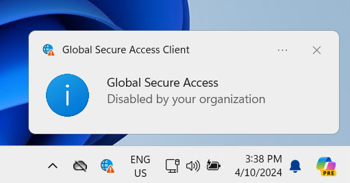

This is a list of known issues you might hit while working with Global Secure Access. We'll keep this list updated and note when issues have been fixed.

## Global Secure Access Windows client

### Windows GSA client shows "Disabled by your organization" and takes 5 minutes to connect

Users might see the GSA client disconnected and the following message:

Additionally, the Event Log "Microsoft-Windows-Global Secure Access Client-Operational" shows event ID 633 and 421 pointing at token acquisition errors.

This happens when Traffic Forwarding Profiles are assigned to selected users (instead of All Users) because of a race condition trying to get tokens after users sign in to Windows.

**Workaround**: assign all your Traffic Forwarding Profiles to All Users.

**Fix**: coming as part of a new GSA client.

### Truncated GSA DNS search suffix leads to flaky Private DNS resolution

As described on the [Windows Troubleshooting section](./WindowsClientTroubleshooting.md) "How does DNS work with GSA?", GSA adds a DNS search suffix to the device (and a matching NRPT rule) to be able to handle short name resolution by directing these queries through the PA tunnel.

Because of a bug, the DNS search suffix GSA adds, might have an invalid character at the end as reported by `ipconfig /all`

Note the missing `l` at the end. Once this truncated suffix is appended, the names fail to be sent through the PA tunnel because the suffix doesn't match the NRPT policy. As a result, DNS queries are sent to the local DNS server instead of the Private Access tunnel and ultimately your connector on-prem.

**Workaround**: use GPO or Intune to set your DNS search suffix list to the appropriate suffixes.
**Fix**: coming as part of a new GSA client.

### Private DNS 'flaky' resolution due to UDP source port reuse
 There is a known issue where DNS names that should be resolved via Private DNS fail and work on retry, typically causing application access issues.
 
 This is due to a bug on how the GSA client handles UDP source port reuse. Fix coming on a new client build.

### NRPT policies missing on devices managed by Group Policies
The GSA client creates NRPT policies to route DNS queries for Private DNS suffixes through the tunnel. In some cases, the NRPT policies fail to be created.
Check using `Get-DNSClientNRPTPolicy`.

This happens because of a malformed GPO that applies NRPT settings.

Use this script to identify the offending policy and delete it after moving the relevant settings to other policies.
Please edit the script and modify the variables as per your environment.

[FindDNSNRPTGPO PowerShell Script](https://github.com/microsoft/GlobalSecureAccess/blob/main/website/content/FindDNSNRPTGPO.ps1)

## Internet Access

### Enabling Internet Forwarding Profile
If you enable the Internet Access traffic forwarding profile, you should **always enable** the Microsoft traffic profile as well. If you only enable the Internet profile, Microsoft traffic will be routed through the Internet Access tunnel, which may result in a suboptimal experience.

**Workaround**: Enable Microsoft traffic forwarding profile in addition to the Internet traffic forwarding profile. We've done a lot of work to make the Microsoft tunnel highly optimized and performant for Microsoft traffic. IA has no such optimizations. Source IP restoration doesn't work in the IA tunnel