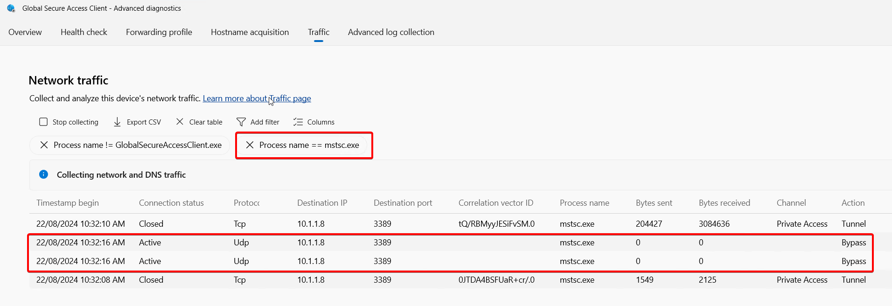
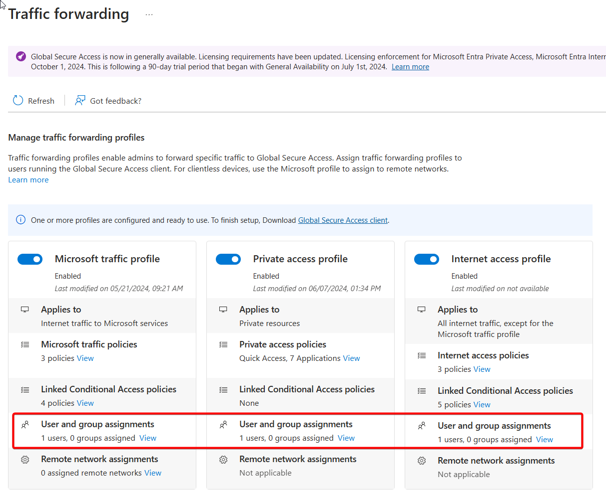

This is a list of known issues you might hit while working with Global Secure Access. We'll keep this list updated and note when issues have been fixed.

### Windows GSA client shows "Disabled by your organization" and takes 5 minutes to connect

Users might see the GSA client disconnected and the following message:

Additionally, the Event Log "Microsoft-Windows-Global Secure Access Client-Operational" shows event ID 633 and 421 pointing at token acquisition errors.

This happens when Traffic Forwarding Profiles are assigned to selected users (instead of All Users) because of a race condition trying to get tokens after users sign in to Windows.

**Workaround**: assign all your Traffic Forwarding Profiles to All Users.

**Fix**: coming as part of a new GSA client.

### Truncated GSA DNS search suffix leads to flaky Private DNS resolution

As described on the [Windows Troubleshooting section](./WindowsClientTroubleshooting.md) "How does DNS work with GSA?", GSA adds a DNS search suffix to the device (and a matching NRPT rule) to be able to handle short name resolution by directing these queries through the PA tunnel.

Because of a bug, the DNS search suffix GSA adds, might have an invalid character at the end as reported by `ipconfig /all`

Note the missing `l` at the end. Once this truncated suffix is appended, the names fail to be sent through the PA tunnel because the suffix doesn't match the NRPT policy. As a result, DNS queries are sent to the local DNS server instead of the Private Access tunnel and ultimately your connector on-prem.

**Workaround**: use GPO or Intune to set your DNS search suffix list to the appropriate suffixes.
**Fix**: coming as part of a new GSA client.

### Enabling Internet Forwarding Profile
If you enable the Internet Access traffic forwarding profile, you should **always enable** the Microsoft traffic profile as well. If you only enable the Internet profile, Microsoft traffic will be routed through the Internet Access tunnel, which may result in a suboptimal experience.

**Workaround**: Enable Microsoft traffic forwarding profile in addition to the Internet traffic forwarding profile. We've done a lot of work to make the Microsoft tunnel highly optimized and performant for Microsoft traffic. IA has no such optimizations. Source IP restoration doesn't work in the IA tunnel

### FIXED - Private DNS 'flaky' resolution. 
 There is a known issue where DNS names that should be resolved via Private DNS fail and work on retry, typically causing application access issues.
 
 Troubleshooting:
 * Force IPv4 only name resolution from the client side, either using ping -4 fqdn or Resolve-DnsName -Type A - Name fqdn. If this provides stable name resolution, you might be hitting this issue.

**Fix**: fixed as part of a cloud service change. Updating GSA client is not required.

[Guidance on disabling IPv6 on Windows](https://learn.microsoft.com/troubleshoot/windows-server/networking/configure-ipv6-in-windows#:~:text=will%20be%20preferred.-,Disable%20IPv6,-Decimal%20255%0AHexadecimal)