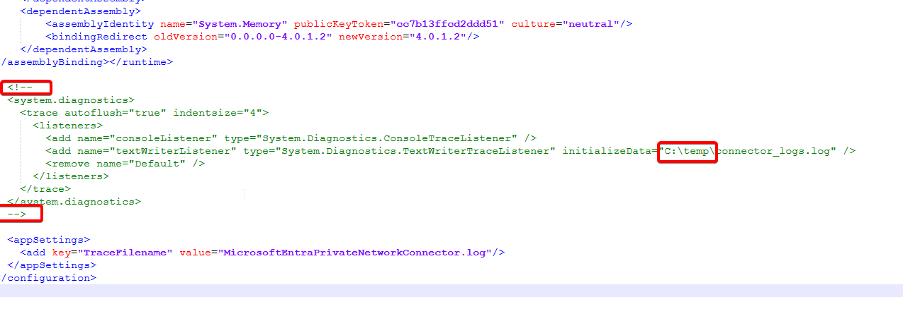

### Is Private Network Connector the problem?

If all your Private Access requests are failing, there is a good chance your Private Network connector is having problems.

If accessing certain private resources fails from all your client devices, then the connector might be having issues connecting to the resource. If possible, test connectivity from the connector server to the resource (i.e.: access file share, RDP, etc).


### Connector shows green on the Entra Portal, all must be good right?

Not quite. The Private Connector connects to different service endpoints using different protocols. The connector users GRPC and mutual TLS authentication to connect to the Private Access cloud service. For this reason, the connector might show "Active" on the Entra Portal / Global Secure Access / Connect / Connectors blade, but might still have problems connecting and serving Private Access requests.

### Enabling advanced connector logging

Edit the file MicrosoftEntraPrivateNetworkConnectorService.exe.config located in the connector installation folder (usually, C:\Program Files\Microsoft Entra private network connector\):
* Delete the comment lines
* Validate the folder exists



Example:
```
  <system.diagnostics>
    <trace autoflush="true" indentsize="4">
      <listeners>
        <add name="consoleListener" type="System.Diagnostics.ConsoleTraceListener" />
        <add name="textWriterListener" type="System.Diagnostics.TextWriterTraceListener" initializeData="C:\temp\connector_logs.log" />
        <remove name="Default" />
      </listeners>
    </trace>
  </system.diagnostics>
```

### RustSslCertificateValidator: Failed to validate chain of certificate

You might see this error on the connector logs if the certificate chain for a service certificate (like *.msappproxy.net) fails to be validated.

If you have configured a proxy server on MicrosoftEntraPrivateNetworkConnectorService.exe.config, make sure you configure a system proxy server as well. Windows certificate operations run on the system context and might be failing due to connectivity issues.
You can set the system proxy using:
```
netsh winhttp set proxy address:port
```

### TLS inspection

Performing TLS inspection on the Private Network connector traffic will interfere with the connector's ability to connect to the service and serving Private Access requests.
Ensure the network devices allowing Internet access to the connector don't perform TLS inspection.